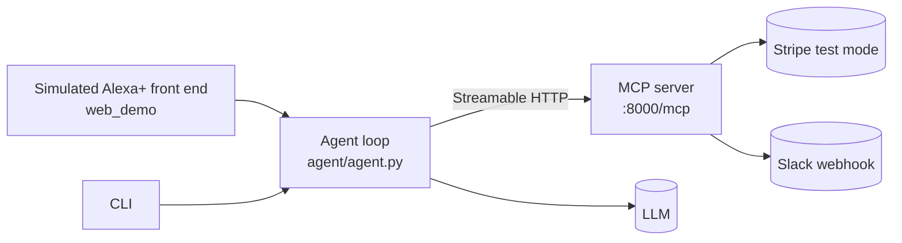

# BusinessFlow Agent

A self-hosted **MCP server** that turns a spoken business request into a
multi-step workflow across Stripe and Slack — built for the
[Amazon Developer Hackathon 2026](https://amazonappdev2026.devpost.com/)
(**Alexa+ track**).

> "Does Acme have anything overdue?" → the agent finds the customer, reads their
> invoices, reasons about what is late, and then, once you confirm, sends the
> reminder and notifies the finance channel.

It is not a Stripe chatbot. The interesting part is orchestration: the agent
chooses the tools and the order, and the same MCP server is reachable from any MCP
host.

## Contents

| Path | What it is |
|---|---|
| `mcp_server/` | Self-hosted MCP server (FastMCP, Streamable HTTP) exposing five business tools |
| `agent/` | Agent loop: plan → call tool → observe → speak |
| `web_demo/` | Browser-based simulated Alexa+ experience (voice in, voice out, tool trace) |
| `skills/` | Agent Skill package — the track's other sanctioned artifact, alongside the MCP server |
| `demo/` | Test-data seeding for a stable demo |
| `tests/` | Offline unit tests for the business rules and voice phrasing |
| `docs/` | Architecture, demo script, Devpost answers, submission checklist |
| `FRICTION_LOG.md` | Friction log kept while building (submission bonus field) |
| `PRODUCT_FEEDBACK.md` | Required product feedback for every tool used |
| `handoff.md` | Working handoff: what it is, where the seams are, what is still open |

## Submission materials

| Artifact | File |
|---|---|
| Devpost answers, paste-ready | [docs/DEVPOST_SUBMISSION.md](docs/DEVPOST_SUBMISSION.md) |
| What is left to do before the deadline | [docs/SUBMISSION_CHECKLIST.md](docs/SUBMISSION_CHECKLIST.md) |
| Product feedback, one section per tool used | [PRODUCT_FEEDBACK.md](PRODUCT_FEEDBACK.md) |
| Friction log (submission bonus field) | [FRICTION_LOG.md](FRICTION_LOG.md) |

## Protocol compliance (Alexa+ track)

The track asks for a self-hosted MCP server on spec **2025-11-25 or later**, over
**Streamable HTTP**, with the track technology actually used in code. How to check
that claim in this repo:

| Requirement | Where |
|---|---|
| Protocol 2025-11-25+ | `requirements.txt` pins `mcp==1.28.1`; that release declares `LATEST_PROTOCOL_VERSION = "2025-11-25"` with `SUPPORTED_PROTOCOL_VERSIONS = ["2024-11-05", "2025-03-26", "2025-06-18", "2025-11-25"]` |
| Streamable HTTP | `mcp_server/server.py` → `mcp.run(transport="http", host=..., port=..., path="/mcp")` |
| MCP client in code | `agent/agent.py` and `web_demo/app.py` both connect with `mcp.client.streamable_http.streamablehttp_client` |

Observed, not just declared — `python scripts/smoke_test.py` starts the server,
connects over Streamable HTTP and prints the negotiated version:

```
PASS: session initialized, protocol 2025-11-25
PASS: 5 tools exposed: find_customer, get_cashflow_summary, get_overdue_invoices,
                       notify_finance_team, send_payment_reminder
```

## Agent Skill

The track accepts **either** a self-hosted MCP server **or** an Agent Skill. This
repository ships both, because they carry different halves of the work:

| Artifact | Carries |
|---|---|
| MCP server (`mcp_server/`) | the capability — Stripe and Slack behind five business-level tools |
| Agent Skill (`skills/cash-collection/`) | the behaviour — how to chase an invoice over voice, when to stop and ask, how to phrase the answer |

The skill is a portable folder following the [Agent Skills](https://agentskills.io)
format: `SKILL.md` plus a `references/` catalogue of the tools. Any
skills-compatible host that can reach the MCP server inherits the same conduct —
the confirmation rule, the spoken-output rules, the disambiguation rule — instead
of re-deriving them.

## Designed to the Alexa+ add-on contract

The Alexa+ add-on runtime is not available to hackathon participants
([FRICTION_LOG.md](FRICTION_LOG.md), Entry 001), so this project targets the
*add-on contract* — what a voice add-on has to do to be usable — rather than the
add-on runtime. Every row is checkable in this repository.

| Requirement of a voice add-on | How it is met | Where |
|---|---|---|
| Answers must be speakable, not printed data | every tool returns `spoken` next to `data` | `mcp_server/messages.py` |
| Never read identifiers aloud | invoice *numbers* only, never ids | `mcp_server/business_rules.py` (`invoice_reference`), `agent/prompts.py` |
| Consequential actions need explicit consent | the tool itself refuses until `confirmed=true` — enforcement is server-side, not prompt-side | `mcp_server/server.py` |
| Ambiguous names are resolved with the user, never guessed | fuzzy match against stored customers, then a question | `mcp_server/business_rules.py`, `mcp_server/server.py` (`_resolve_customer`) |
| Failures are spoken in plain language | task-group wrappers are unwrapped into one actionable sentence | `agent/llm.py` (`describe_error`), `agent/prompts.py` |
| Follow-ups work without repeating context | conversation history per session, trimmed | `agent/agent.py` |
| A turn has to finish quickly | bounded Stripe queries; the simulator measures and displays the wait | `mcp_server/stripe_tools.py`, `web_demo/static/app.js` |
| The user can interrupt the assistant | talking over it cancels speech and starts listening | `web_demo/static/app.js` (barge-in) |
| Mishearing is recoverable | "I didn't catch that" plus one-tap retry | `web_demo/static/app.js` |

What we would build with Preview access, for the record: the add-on runtime would
replace `web_demo/` and nothing else. The MCP server, the tool contracts and the
Agent Skill stay as they are, because that is where the work is.

## Architecture



Full detail: [docs/ARCHITECTURE.md](docs/ARCHITECTURE.md).

## Quick start

```bash
python -m venv .venv
# Windows: .venv\Scripts\activate
source .venv/bin/activate
pip install -r requirements.txt

cp .env.example .env      # then fill in STRIPE_API_KEY, SLACK_WEBHOOK_URL, LLM_API_KEY
```

### 1. Seed demo data (Stripe test mode)

```bash
python -m demo.seed_test_data
```

The seeder creates a Stripe **test clock** frozen 90 days in the past and writes
`STRIPE_TEST_CLOCK` into `.env`. The reason is a platform constraint: Stripe
refuses to create *or* back-date an invoice whose due date is already in the past,
so a fresh test account cannot simply be handed overdue invoices. A test clock is
the supported way to produce them — and because objects on a clock are invisible
to the account-wide list endpoints, the MCP server scopes its reads to that clock.

**Restart the MCP server after seeding**, so it picks the clock up. The script is
repeatable: it voids the previous run's invoices before creating new ones, so you
can refresh the numbers immediately before recording.

### 2. Run the MCP server

```bash
python -m mcp_server.server
# Streamable HTTP endpoint: http://127.0.0.1:8000/mcp
# (without MCP_HTTP=1 it speaks stdio, e.g. for Cursor or Claude Desktop)
```

### 3. Run the simulated Alexa+ experience

```bash
python -m web_demo.app
# open http://127.0.0.1:8080
```

### Or drive the agent from the CLI

```bash
python -m agent.agent "Does Acme have anything overdue?"
```

## Tools exposed by the MCP server

| Tool | Kind | Purpose |
|---|---|---|
| `find_customer` | read | Resolve a spoken name to a Stripe customer, with fuzzy candidates |
| `get_overdue_invoices` | read | Overdue invoices for a customer: amounts, days overdue, payment links |
| `get_cashflow_summary` | read | Outstanding and overdue totals across the account |
| `send_payment_reminder` | write | Email the customer their invoice |
| `notify_finance_team` | write | Post the outcome to the finance Slack channel |

Read tools may be called unprompted. **Write tools require explicit user
confirmation** — enforced in `agent/prompts.py` and demonstrated in the demo.

Every tool returns structured `data` plus a `spoken` line, so the same result can
feed a dashboard or a voice assistant without a second round trip.

## Tests

Offline, no Stripe/Slack/LLM calls:

```bash
python -m unittest discover -s tests -v
```

Covered: overdue detection and ageing, zero-decimal currency handling, fuzzy
customer matching, and the phrasing of the spoken summaries.

End-to-end, against a real Streamable HTTP handshake (no Stripe key needed):

```bash
python scripts/smoke_test.py
```

This starts the server on a test port, initializes an MCP session, lists the tools
and reports the negotiated protocol version.

## Configuration

| Variable | Purpose |
|---|---|
| `STRIPE_API_KEY` | Stripe **test** key (`sk_test_...`) |
| `STRIPE_TEST_CLOCK` | Optional: scope Stripe reads to a test clock (written by the seeder) |
| `SLACK_WEBHOOK_URL` | Incoming webhook for the finance channel |
| `SLACK_FINANCE_CHANNEL` | Channel label used in confirmations (display only) |
| `LLM_API_KEY` / `LLM_BASE_URL` / `LLM_MODEL` | Agent's model endpoint |
| `MCP_HTTP`, `MCP_HOST`, `MCP_PORT`, `MCP_URL` | MCP server transport and client target |
| `WEB_PORT` | Simulator port |

### Running the agent on Amazon Bedrock (AWS Builder mini challenge)

Set `LLM_PROVIDER=bedrock`. Credentials follow the layout used by the
[SmartSales-AI](https://github.com/zhuwensh/SmartSales-AI) project, so the demo is
self-contained instead of depending on machine-level state:

1. In the AWS console, pick a region and enable access to the model under
   **Amazon Bedrock → Model access**. Model access is **per region**.
2. Create an IAM user with `bedrock:InvokeModel` and
   `bedrock:InvokeModelWithResponseStream` (the Converse API is authorised by
   `InvokeModel`), and generate an access key.
3. Put the credentials in the repository folder — `.aws/` is git-ignored:

   ```ini
   # .aws/credentials
   [default]
   aws_access_key_id = ...
   aws_secret_access_key = ...
   ```

4. Point `.env` at it:

   ```ini
   LLM_PROVIDER=bedrock
   AWS_REGION=ap-northeast-1
   BEDROCK_MODEL_ID=openai.gpt-oss-20b-1:0
   AWS_PROFILE=default
   AWS_SHARED_CREDENTIALS_FILE=./.aws/credentials
   ```

5. Check it before trusting it:

   ```bash
   python scripts/check_bedrock.py
   ```

   The script verifies credentials, a plain Converse call, **and tool calling** —
   the last one matters because an agent loop that never receives a `toolUse`
   block is not an agent. If the model answers without calling the tool, change
   `BEDROCK_MODEL_ID`; no code changes are needed.

## Security

Never commit `STRIPE_API_KEY`, `SLACK_WEBHOOK_URL` or `LLM_API_KEY`. `.env` is
git-ignored; use test-mode credentials for the demo. The MCP endpoint binds to
`127.0.0.1` unless you deliberately expose it.

## License

Apache License 2.0 — see [LICENSE](LICENSE).
