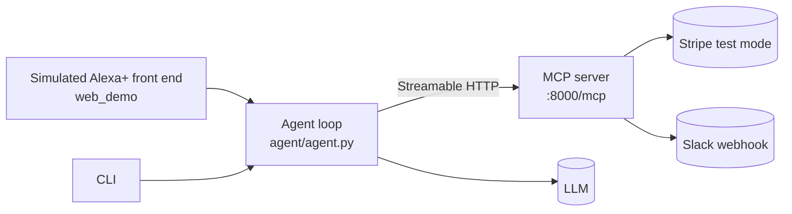

# BusinessFlow Agent

A self-hosted **MCP server** that turns a spoken business request into a
multi-step workflow across Stripe and Slack — built for the
[Amazon Developer Hackathon 2026](https://amazonappdev2026.devpost.com/)
(**Alexa+ track**).

> "Does Acme have anything overdue?" → the agent finds the customer, reads their
> invoices, reasons about what is late, and then, once you confirm, sends the
> reminder and notifies the finance channel.

It is not a Stripe chatbot. The interesting part is orchestration: the agent
chooses the tools and the order, and the same MCP server is reachable from any MCP
host.

## Contents

| Path | What it is |
|---|---|
| `mcp_server/` | Self-hosted MCP server (FastMCP, Streamable HTTP) exposing five business tools |
| `agent/` | Agent loop: plan → call tool → observe → speak |
| `web_demo/` | Browser-based simulated Alexa+ experience (voice in, voice out, tool trace) |
| `demo/` | Test-data seeding for a stable demo |
| `tests/` | Offline unit tests for the business rules and voice phrasing |
| `docs/` | Architecture and demo script |
| `FRICTION_LOG.md` | Friction log kept while building (submission bonus field) |
| `PRODUCT_FEEDBACK.md` | Required product feedback for every tool used |

## Protocol compliance (Alexa+ track)

The track asks for a self-hosted MCP server on spec **2025-11-25 or later**, over
**Streamable HTTP**, with the track technology actually used in code. How to check
that claim in this repo:

| Requirement | Where |
|---|---|
| Protocol 2025-11-25+ | `requirements.txt` pins `mcp==1.28.1`; that release declares `LATEST_PROTOCOL_VERSION = "2025-11-25"` with `SUPPORTED_PROTOCOL_VERSIONS = ["2024-11-05", "2025-03-26", "2025-06-18", "2025-11-25"]` |
| Streamable HTTP | `mcp_server/server.py` → `mcp.run(transport="http", host=..., port=..., path="/mcp")` |
| MCP client in code | `agent/agent.py` and `web_demo/app.py` both connect with `mcp.client.streamable_http.streamablehttp_client` |

Observed, not just declared — `python scripts/smoke_test.py` starts the server,
connects over Streamable HTTP and prints the negotiated version:

```
PASS: session initialized, protocol 2025-11-25
PASS: 5 tools exposed: find_customer, get_cashflow_summary, get_overdue_invoices,
                       notify_finance_team, send_payment_reminder
```

## Architecture



Full detail: [docs/ARCHITECTURE.md](docs/ARCHITECTURE.md).

## Quick start

```bash
python -m venv .venv
# Windows: .venv\Scripts\activate
source .venv/bin/activate
pip install -r requirements.txt

cp .env.example .env      # then fill in STRIPE_API_KEY, SLACK_WEBHOOK_URL, LLM_API_KEY
```

### 1. Seed demo data (Stripe test mode)

```bash
python -m demo.seed_test_data
```

### 2. Run the MCP server

```bash
python -m mcp_server.server
# Streamable HTTP endpoint: http://127.0.0.1:8000/mcp
# (without MCP_HTTP=1 it speaks stdio, e.g. for Cursor or Claude Desktop)
```

### 3. Run the simulated Alexa+ experience

```bash
python -m web_demo.app
# open http://127.0.0.1:8080
```

### Or drive the agent from the CLI

```bash
python -m agent.agent "Does Acme have anything overdue?"
```

## Tools exposed by the MCP server

| Tool | Kind | Purpose |
|---|---|---|
| `find_customer` | read | Resolve a spoken name to a Stripe customer, with fuzzy candidates |
| `get_overdue_invoices` | read | Overdue invoices for a customer: amounts, days overdue, payment links |
| `get_cashflow_summary` | read | Outstanding and overdue totals across the account |
| `send_payment_reminder` | write | Email the customer their invoice |
| `notify_finance_team` | write | Post the outcome to the finance Slack channel |

Read tools may be called unprompted. **Write tools require explicit user
confirmation** — enforced in `agent/prompts.py` and demonstrated in the demo.

Every tool returns structured `data` plus a `spoken` line, so the same result can
feed a dashboard or a voice assistant without a second round trip.

## Tests

Offline, no Stripe/Slack/LLM calls:

```bash
python -m unittest discover -s tests -v
```

Covered: overdue detection and ageing, zero-decimal currency handling, fuzzy
customer matching, and the phrasing of the spoken summaries.

End-to-end, against a real Streamable HTTP handshake (no Stripe key needed):

```bash
python scripts/smoke_test.py
```

This starts the server on a test port, initializes an MCP session, lists the tools
and reports the negotiated protocol version.

## Configuration

| Variable | Purpose |
|---|---|
| `STRIPE_API_KEY` | Stripe **test** key (`sk_test_...`) |
| `SLACK_WEBHOOK_URL` | Incoming webhook for the finance channel |
| `SLACK_FINANCE_CHANNEL` | Channel label used in confirmations (display only) |
| `LLM_API_KEY` / `LLM_BASE_URL` / `LLM_MODEL` | Agent's model endpoint |
| `MCP_HTTP`, `MCP_HOST`, `MCP_PORT`, `MCP_URL` | MCP server transport and client target |
| `WEB_PORT` | Simulator port |

## Security

Never commit `STRIPE_API_KEY`, `SLACK_WEBHOOK_URL` or `LLM_API_KEY`. `.env` is
git-ignored; use test-mode credentials for the demo. The MCP endpoint binds to
`127.0.0.1` unless you deliberately expose it.

## License

Apache License 2.0 — see [LICENSE](LICENSE).
