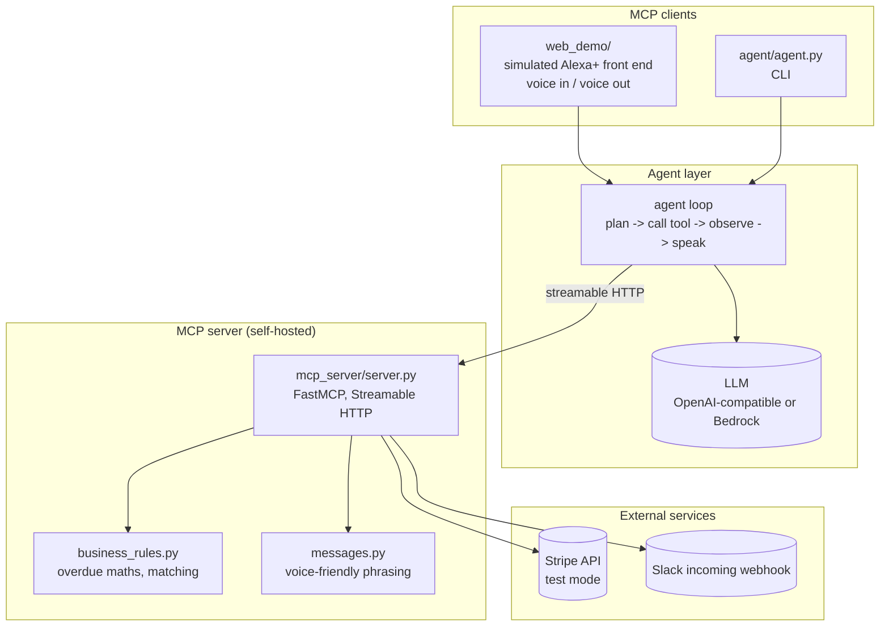
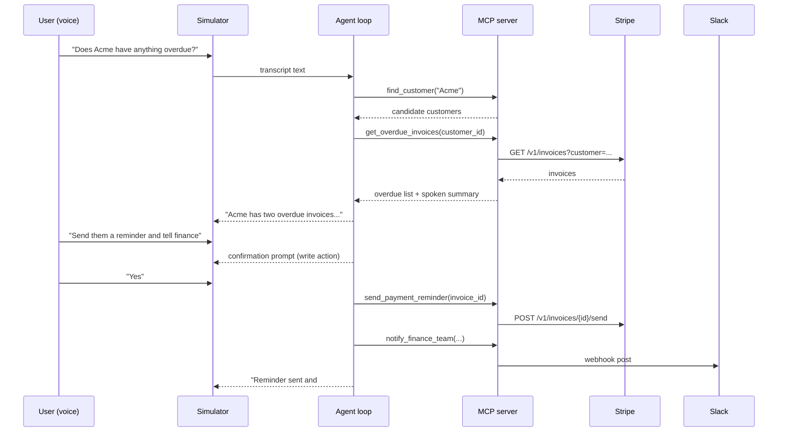

# Architecture

BusinessFlow Agent is a self-hosted MCP server that exposes business operations as
tools, plus two clients: an agent loop and a browser-based simulated Alexa+
experience.

## System

## Why the split

**Business logic is not in the LLM prompt.** `business_rules.py` owns overdue
detection, money maths and customer matching so those can be unit-tested with no
network, no Stripe key and no model in the loop. The agent decides *which* tool to
call and *in what order*; it does not do arithmetic.

**Voice shaping is a first-class layer.** `messages.py` turns a tool result into a
speakable sentence. A dashboard wants the full JSON; a voice assistant wants
"Acme has two overdue invoices totalling $3,200.00, the oldest 18 days overdue."
Every tool returns both: structured data under `data`, and the spoken line under
`spoken`.

**The MCP server is the only thing that talks to Stripe and Slack.** Both clients
(simulator and CLI) are MCP clients. That is what makes the integration reusable
and keeps the demo honest — the same server would be reachable from any other MCP
host.

## Tool set

| Tool | Kind | Purpose |
|---|---|---|
| `find_customer` | read | Resolve a spoken name to a customer (fuzzy match, returns candidates) |
| `get_overdue_invoices` | read | Overdue invoices for a customer, with amounts, days overdue and payment links |
| `get_cashflow_summary` | read | Workspace-wide outstanding / overdue totals |
| `send_payment_reminder` | write | Email the customer their invoice (Stripe `invoices/{id}/send`) |
| `notify_finance_team` | write | Post the outcome to the finance Slack channel |

Read tools are safe to call unprompted. Write tools are only called after the user
confirms, because the agent's system prompt requires it and because a spoken
assistant that sends customer email on inference would not be shippable.

## Protocol compliance

The Alexa+ track requires a self-hosted MCP server on spec **2025-11-25 or later**
using **Streamable HTTP**.

| Requirement | Implementation | Evidence |
|---|---|---|
| Protocol 2025-11-25+ | pinned `mcp==1.28.1` | that release declares `LATEST_PROTOCOL_VERSION = "2025-11-25"` and `SUPPORTED_PROTOCOL_VERSIONS = ["2024-11-05", "2025-03-26", "2025-06-18", "2025-11-25"]` |
| Streamable HTTP | `server.py` runs `FastMCP.run(transport="http", ...)` | FastMCP's `http` transport is Streamable HTTP; clients connect at `http://<host>:8000/mcp` |
| MCP client in-repo | `mcp.client.streamable_http.streamablehttp_client` | used by both `agent/agent.py` and `web_demo/app.py` |

## Request flow (multi-step action)

## Security

| Topic | Approach |
|---|---|
| Secrets | `.env` only, git-ignored; `.env.example` ships with placeholders |
| Stripe | test mode (`sk_test_...`) for the demo; the server warns on non-test keys |
| Slack | incoming webhook URL, no OAuth token and no workspace-wide scope |
| MCP endpoint | binds `127.0.0.1` by default; expose deliberately behind a reverse proxy |
| Write actions | gated behind explicit user confirmation in the agent loop |
